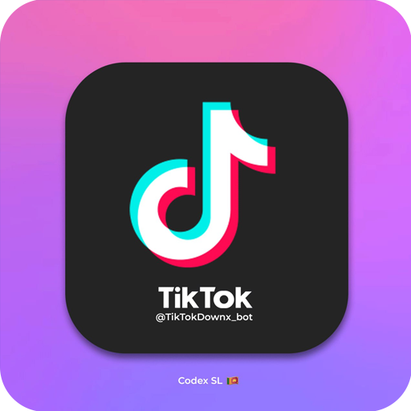

# 🎬 TikTok Downloader Bot | Download Without Watermark
<div align="center">


</div>

<div align="center">
  <a href="https://t.me/TikTokDownx_bot"></a>
  <a href="https://t.me/Codex_SL"></a>
  
  
</div>

## 💫 Download TikTok Videos With Style

Welcome to the **TikTok Downloader Bot** (@TikTokDownx_bot), your ultimate solution for saving and sharing TikTok content without restrictions. Designed to provide a seamless experience, our bot lets you enjoy TikTok videos without those annoying watermarks, convert to different formats, and more!

## ✨ Powerful Features

Our TikTok Downloader Bot stands out with a comprehensive set of features designed to enhance your TikTok experience:

### 🚀 Core Capabilities
| Feature | Description |
|---------|-------------|
| ☠️ **Watermark-Free Downloads** | Save videos without the TikTok logo and username overlay |
| 🏖️ **Group Support** | Works perfectly in group chats - share with friends! |
| 🛡️ **Media Cache** | Faster downloads through smart caching system |
| 🕺 **Round Video Conversion** | Transform videos into perfect circles for profile pictures |
| 🔈 **MP3 Extraction** | Pull just the audio track from any TikTok video |
| ☘️ **Inline Sharing** | Share videos directly in any chat through inline mode |
| 🔍 **Music Track Finder** | Identify and extract the soundtrack from TikTok videos |
| ✅ **Always Available** | 24/7 service with no downtime |

## 📖 Tutorial

Simply start the bot and send any TikTok URL - it's that easy! Check out our [Visual Tutorial](https://t.me/Codex_SL/110) for more details.

## 🧭 Easy-to-Use Guide

```
START → SEND TIKTOK LINK → CHOOSE FORMAT → DOWNLOAD → SHARE
```

1. **Begin**: Start a chat with [@TikTokDownx_bot](https://t.me/TikTokDownx_bot)
2. **Share Link**: Send any TikTok video URL to the bot
3. **Select Format**: Choose your preferred download format (video, round video, audio)
4. **Instant Download**: Receive your content immediately
5. **Enjoy & Share**: Use the downloaded content anywhere!

## 💎 Advanced Usage Tips

Get the most out of your TikTok Downloader Bot with these pro tips:

### 🔥 Power User Features
- **Inline Mode**: Type `@TikTokDownx_bot` in any chat followed by a TikTok link
- **Share Directly**: Forward downloaded videos to other chats with a single tap
- **Find Music**: Use the music identification feature to discover new tracks

## 🤝 Community Support
Join our growing community of TikTok enthusiasts:

- **Updates**: Follow [@Codex_SL](https://t.me/Codex_SL) for the latest bot improvements
- **Share**: Invite friends to use the bot for better TikTok experiences

## 📜 Terms of Service

This bot is provided for personal use only. Please respect TikTok's terms of service and copyright laws when using downloaded content.

## 📞 Contact & Support

- **Developer**: [@thejan_go](https://t.me/thejan_go)
- **Support Channel**: [@Codex_SL](https://t.me/Codex_SL)

---

<div align="center">
  <p>Created with 🔥 by @thejan_go</p>
  <p>Proudly powered by @Codex_SL 🇱🇰</p>
</div>